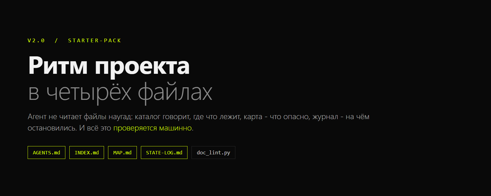
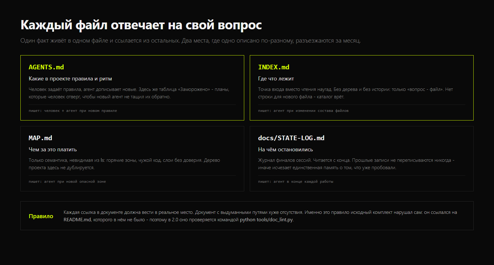
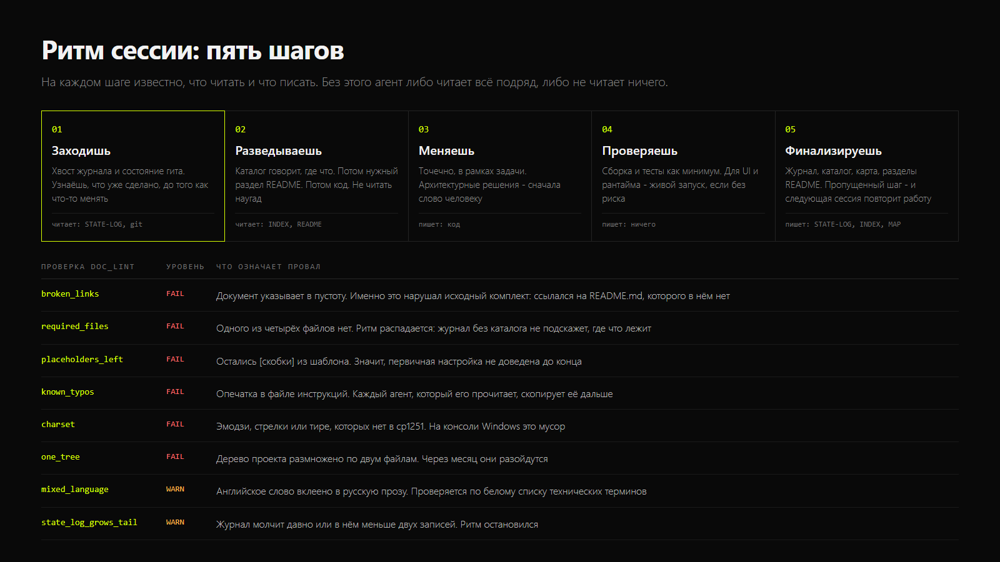

# Starter Pack v2.0

**Комплект документационного ритма проекта: агент не читает файлы наугад.**



Четыре файла задают порядок работы с документацией: где что лежит, что опасно
менять, на чём остановилась прошлая сессия и какие правила приняты в проекте.
Плюс инструменты, которые этот порядок создают и проверяют.

Работает с любым агентом: Claude Code, Codex CLI, Cursor, Gemini CLI, Cline,
Aider, OpenCode - везде, где агент читает текстовые файлы проекта.

```
git clone git@github.com:Samiixo/Starter_pack-skill.git
```

---

## Проблема, которую это решает

Агент без комплекта работает так: читает десять файлов «на всякий случай»,
сжигает контекст, меняет не то место, а в конце не записывает, что сделал.
Следующая сессия начинается с нуля и повторяет разбор. Ещё через месяц новый
агент предлагает решение, которое человек уже отверг - потому что разговор, где
это отвергли, не сохранился нигде.

Комплект закрывает четыре вопроса:

| Файл | Вопрос |
|---|---|
| `AGENTS.md` | какие в проекте правила и ритм работы |
| `INDEX.md` | где что лежит (вопрос -> файл), вместо чтения наугад |
| `MAP.md` | чем платить за правку в этом месте |
| `docs/STATE-LOG.md` | на чём остановилась прошлая сессия |



Разделение ролей - то, что обычно размывается. `README` отвечает «что это»,
и только в нём живёт дерево проекта. `INDEX` - «где это». `MAP` - «что здесь
опасно». `STATE-LOG` - «что уже сделано». Один факт живёт в одном файле и
ссылается из остальных: два места с одним фактом расходятся за месяц.

---

## Что нового в 2.0

Исходный комплект держался только на прозе - и **первое же своё правило
нарушал сам**. Правило гласит:

> Каждая ссылка в документе должна вести в реальное место.
> Документ с выдуманными путями хуже отсутствия.

А `INDEX.md` ссылался на `README.md`, которого в комплекте не было. Это и есть
разница между версиями: в 2.0 правило проверяется машинно.

Найденные дефекты исходника:

| Что | Где | Чем плохо |
|---|---|---|
| Ссылка на `README.md` | `INDEX.md:9` | файла в комплекте нет - прямое нарушение своего правила |
| `Legay-ветки` | `INDEX.md:29` | опечатка в файле инструкций: её скопирует каждый агент |
| `какrestart` | `AGENTS.md:8` | английский глагол приклеен к русскому слову без пробела |
| `recently` в русской прозе | `INDEX.md:14` | смешение языков там, где оно не нужно |
| Осиротевший `Type: fact` | `STATE-LOG.md:9` | токен без объяснения - никому не понятно, что это |
| Эмодзи, тире, стрелки | все файлы | этих символов нет в cp1251: на консоли Windows мусор |

---

## Инструменты



### Создание комплекта

```bash
# посмотреть, что будет создано, ничего не меняя
python tools/init_docs.py --target D:\new-project --dry-run

# создать
python tools/init_docs.py --target D:\new-project --project-name "Название"
```

Существующие файлы не затираются: комплект сам запрещает затирать `AGENTS.md`
вслепую, поэтому есть либо отказ, либо `--force` с `.bak`.

Отдельно про `README`: комплект на него ссылается, поэтому при создании в
проекте без README инструмент предупреждает **прямо**, а
`--create-readme-stub` создаёт заготовку. Иначе создание комплекта сразу
порождало бы битую ссылку - тот самый дефект, ради которого сделана версия 2.0.

### Проверка, что документация не врёт

```bash
python tools/doc_lint.py D:\project
```

| Проверка | Уровень | Что означает провал |
|---|---|---|
| `broken_links` | FAIL | ссылка ведёт в пустоту |
| `required_files` | FAIL | одного из четырёх файлов нет |
| `placeholders_left` | FAIL | остались `[скобки]` из шаблона |
| `known_typos` | FAIL | опечатка в файле инструкций |
| `charset` | FAIL | символы, которых нет в cp1251 |
| `one_tree` | FAIL | дерево проекта размножено по двум файлам |
| `mixed_language` | WARN | английское слово вклеено в русскую прозу |
| `state_log_grows_tail` | WARN | журнал молчит или пуст |

Инструмент различает два класса болезней намеренно: **«документация врёт о
репозитории»** (FAIL) и **«комплект перестали вести»** (WARN). Это разные
недуги с разными лекарствами, и валить их в одну кучу - терять сигнал.

**Честно о методе:** проверки по тексту - эвристики, а не доказательство.
Совпадение по заголовку-якорю и распознавание «английского слова в русской
фразе» работают по белому списку технических терминов и помечены в выводе как
эвристика. Они не могут доказать, что документ верен; они могут не дать ему
пройти молча.

### Журнал

```bash
python tools/state_log.py --target . --wave "правка авторизации" \
    --done "что сделано, с фактами" --open "что осталось"
```

Дописывает запись в конец, никогда не переписывая прошлые. Хеш берётся из
`git rev-parse`, а если это не git-репозиторий, пишется `none`: выдуманный хеш
хуже отсутствующего.

---

## Ритм сессии

1. **Заходишь** - хвост `STATE-LOG` и `git status` / `git log -3`.
2. **Разведываешь** - `INDEX` (где что) -> нужный раздел README -> код.
3. **Меняешь** - точечно, в рамках задачи. Архитектурные решения - сначала человеку.
4. **Проверяешь** - сборка и тесты как минимум.
5. **Финализируешь** - запись в журнал, обновление каталога и карты.

Пропущенный пятый шаг - не мелочь: именно из-за него следующая сессия
повторяет работу. Подробно - `references/rhythm.md`.

---

## Быстрый старт

```bash
git clone git@github.com:Samiixo/Starter_pack-skill.git
cd Starter_pack-skill

# тесты самого комплекта
python tests/run_selftest.py

# создать комплект в проекте
python tools/init_docs.py --target D:\project --dry-run
python tools/init_docs.py --target D:\project

# проверить
python tools/doc_lint.py D:\project
```

Свежесозданный комплект `doc_lint` **не проходит**, и это правильно. В шаблонах
стоят плейсхолдеры, которые заполняет агент по фактам репозитория; пока они на
месте, документация действительно не готова, и проверка `placeholders_left`
обязана это сказать. Зелёным комплект становится после заполнения. Что после
создания не появилось **второго** FAIL, проверяет тест 12: если комплект начнёт
врать о репозитории сразу после создания, тест покраснеет.

Требуется Python 3.9+, только стандартная библиотека.

Дальше - отдать агенту промпт из `references/rhythm.md` и раздел «Первичная
настройка» шаблона `AGENTS.md`: агент заполнит плейсхолдеры фактами из репо,
проверив их, а не выдумав, и удалит блок настройки после заполнения.

---

## Структура

    starter-pack-skill/
    |-- SKILL.md                    вход: когда применять и что внутри
    |-- templates/                  четыре файла комплекта
    |   |-- AGENTS.md  INDEX.md  MAP.md  STATE-LOG.md
    |-- references/
    |   |-- files-guide.md          за что отвечает каждый файл
    |   |-- rhythm.md               ритм сессии по шагам
    |   `-- traps.md                ловушки, ради которых комплект существует
    |-- tools/
    |   |-- init_docs.py            создание комплекта
    |   |-- doc_lint.py             проверка документации против репозитория
    |   `-- state_log.py            запись финала сессии
    |-- examples/worked-example.md  как выглядит рабочий комплект
    |-- docs/original/              исходный комплект как есть, для истории
    `-- tests/run_selftest.py

---

## English summary

A four-file documentation rhythm pack for AI coding agents, plus the tooling to
create and enforce it. The agent does not read files at random: `INDEX.md` is
the question-to-file catalog, `MAP.md` holds semantics invisible from `ls`
(dangerous zones, foreign code, layers not to be trusted), `docs/STATE-LOG.md`
is the append-only session journal read from the end, and `AGENTS.md` carries
the rules and a "frozen" table of plans the owner rejected so a new agent does
not resurrect them.

The v1 of this pack was prose only, and it **broke its own first rule**: it
instructed that every path in a document must exist, while its `INDEX.md`
linked to a `README.md` the pack never shipped. v2.0 makes the rule
enforceable.

- `tools/init_docs.py` creates the kit, never clobbers an existing file, has a
  provable `--dry-run`, and warns when the catalog would immediately point at a
  missing `README.md` (`--create-readme-stub` fixes it).
- `tools/doc_lint.py` checks that the documentation does not lie about the
  repository: dead links, missing required files, leftover placeholders, known
  typos, characters absent from cp1251, a project tree duplicated across two
  files, and a journal that stopped growing. It distinguishes two failure
  classes on purpose - "the docs lie" (FAIL) and "the kit stopped being
  maintained" (WARN) - because they need different remedies.
- `tools/state_log.py` appends a session entry and never rewrites history; it
  reports `none` rather than inventing a git hash.

Written in Russian because the pack's domain and audience are Russian.
Python 3.9+, stdlib only, cp1251-safe output. MIT licensed.

---

## Лицензия

MIT, `Copyright (c) 2026 Samiixo`. Список изменений относительно исходного
комплекта - в `CHANGELOG.md`, происхождение - в `NOTICE.md`.